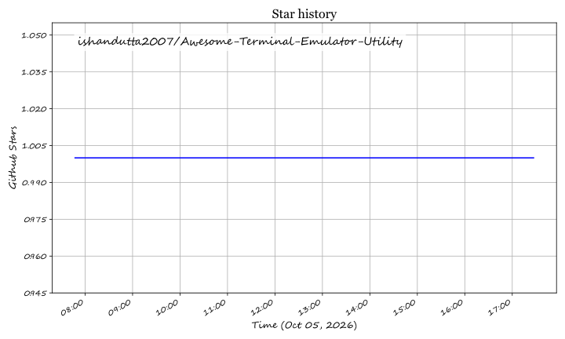

  

  
  
  
  
  

---

# 🚀 Top Terminal Emulator Utility Ecosystem (2026 Edition)

Welcome to the ultimate **Awesome Terminal Emulator Utility** index! This curated list tracks notable **commercial SaaS platforms**, modern **terminal emulators**, and **open-source CLI tools** designed to drastically increase command-line productivity, shell speed, remote server management, and workflow ergonomics.

> 🔍 **SEO & Search Keywords**: Terminal Emulators, CLI Productivity Tools, Shell Enhancements, Warp AI Terminal, iTerm2, Alacritty, Kitty, Starship Prompt, fzf, ripgrep, zoxide, lazygit, Zellij, tmux, Atuin, TUI System Monitors, Zsh, Fish, PowerShell, Linux CLI Utilities.

---

## 📑 Table of Contents

- [🌐 SaaS & Commercial Terminal Platforms](#-saas--commercial-terminal-platforms)
- [⭐ Open-Source GitHub Projects (Sorted by Stars)](#-open-source-github-projects-sorted-by-stars)
  - [🖥️ Terminal Emulators & Shells](#️-terminal-emulators--shells)
  - [⚡ Shell Prompts & Configuration Frameworks](#-shell-prompts--configuration-frameworks)
  - [🔍 Command History, Fuzzy Search & Navigation](#-command-history-fuzzy-search--navigation)
  - [📁 Modern File & Text Utilities](#-modern-file--text-utilities)
  - [🪟 Terminal Multiplexers & Session Managers](#-terminal-multiplexers--session-managers)
  - [📊 Process Monitors, TUIs & DevOps Workflows](#-process-monitors-tuis--devops-workflows)
- [🛠️ Recommended Terminal Stacks](#️-recommended-terminal-stacks)
- [🤝 How to Contribute](#-how-to-contribute)
- [💖 Support & Community](#-support--community)
- [📈 Star History](#-star-history)
- [⚠️ Disclaimer](#️-disclaimer)

---

## 🌐 SaaS & Commercial Terminal Platforms

> 📊 **Market Insights**: The global **Terminal & Developer CLI Tools market size** is estimated at **~$1.8 Billion in 2026** (projected to reach $3.5B by 2030 at 14.2% CAGR). The market structure is **moderately fragmented**, with legacy proprietary enterprise remote access utilities coexisting alongside high-growth AI-native cloud-connected terminal startups.

Below is a curated evaluation of leading commercial and enterprise terminal solutions, sorted by **Company Size & Valuation (Descending)**:

| Product / Platform 🛠️ | Company Size / Revenue / Valuation 🏢 | Pricing (Starting Paid Tier) 💳 | Free Tier / Trial Limit 🎁 | Description & Key Features 📝 |
| :--- | :--- | :--- | :--- | :--- |
| **[Windows Terminal](https://github.com/microsoft/terminal)** | **~$3.1 Trillion Market Cap** / $245B ARR *(Microsoft Corp)* | **$0 / Free** (Open-Source Core) | **100% Free Unlimited** (MIT License, pre-installed on Windows 11) | High-performance GPU-accelerated text rendering engine, tabs, split panes, custom themes, and native WSL2 integration. |
| **[Warp](https://www.warp.dev/)** | **~$500 Million Valuation** *(Series B led by Sequoia Capital)* | **$15/user/month** (Team Plan) | **Free for Individual Use** (Includes 100 Warp AI requests/mo & 1 shared team drive) | Rust-based AI terminal with IDE-like text editing, block-based command execution, collaborative Warp Drive, and automated CLI scripts. |
| **[Termius](https://www.termius.com/)** | **~$30 Million ARR** / ~$150M Est. Valuation *(Termius Inc.)* | **$10/user/month** ($120/yr Pro Plan) | **Free Starter Plan** (Unlimited local connections on 1 device, basic SSH/SFTP, no cloud sync) | Modern cross-platform SSH client & terminal emulator with end-to-end encrypted session sync, snippets, and SFTP browser across desktop and mobile. |
| **[SecureCRT](https://www.vandyke.com/products/securecrt/)** | **~$20 Million ARR** *(VanDyke Software)* | **$99.00/user** (1-Year License with updates) | **30-Day Free Trial** (Fully functional evaluation version for Windows, Mac, and Linux) | Enterprise-grade rock-solid SSH/Telnet terminal emulator with advanced session management, automated scripting (Python/VBScript), and FIPS 140-2 compliance. |
| **[MobaXterm](https://mobaxterm.mobatek.net/)** | **~$8 Million ARR** *(Mobatek)* | **$69.00/user** (Professional Edition one-time per year) | **Free Home Edition** (Max 12 SSH/X11 sessions, 2 SSH tunnels, and 4 active macros) | The ultimate Swiss Army knife for Windows remote computing — includes built-in X11 server, SFTP browser, RDP, VNC, and tabbed terminal client. |
| **[Royal TS](https://www.royalapps.com/main/home)** | **~$5 Million ARR** *(Royal Applications)* | **€59.00 (~$64.00)** (Individual License) | **Royal TS Lite Free** (Fully functional free tier restricted to a max limit of 10 document objects/connections) | Comprehensive remote management tool for terminal sessions, SSH, RDP, VNC, and credential vaults for sysadmins and IT teams. |

---

## ⭐ Open-Source GitHub Projects (Sorted by Stars)

Open-source utilities form the backbone of modern shell ergonomics. Below are top-tier open-source projects rank-ordered by **GitHub Stars_Count (Descending)**:

### 🖥️ Terminal Emulators & Shells

- **[Windows Terminal](https://github.com/microsoft/terminal)**   
  *Microsoft's official open-source, fast, tabbed terminal emulator for Windows 10 & 11.*  
- **[Neovim](https://github.com/neovim/neovim)**   
  *Vim-fork focused on extensibility and usability, featuring embedded terminal support and Lua scripting.*  
- **[Alacritty](https://github.com/alacritty/alacritty)**   
  *A cross-platform, OpenGL-accelerated terminal emulator written in Rust focused on raw performance.*  
- **[Hyper](https://github.com/vercel/hyper)**   
  *JS/HTML/CSS-based extensible terminal app built on Web technologies by Vercel.*  
- **[Nushell](https://github.com/nushell/nushell)**   
  *A modern shell that treats output as structured data tables rather than unstructured raw text streams.*  
- **[Kitty](https://github.com/kovidgoyal/kitty)**   
  *Fast, feature-rich, GPU-accelerated terminal emulator supporting graphics inline, tabs, and tiling.*  
- **[fish-shell](https://github.com/fish-shell/fish-shell)**   
  *Smart and user-friendly command-line shell for Linux, macOS, and Windows with out-of-the-box syntax autosuggestions.*  
- **[WezTerm](https://github.com/wez/wezterm)**   
  *GPU-accelerated cross-platform terminal emulator & multiplexer written in Rust, configured with Lua.*  

---

### ⚡ Shell Prompts & Configuration Frameworks

- **[Oh My Zsh](https://github.com/ohmyzsh/ohmyzsh)**   
  *The community-driven framework for managing Zsh configurations with 300+ plugins and 150+ themes.*  
- **[Starship](https://github.com/starship/starship)**   
  *The minimal, blazing-fast, and infinitely customizable prompt for any shell (written in Rust).*  
- **[Powerlevel10k](https://github.com/romkatv/powerlevel10k)**   
  *Zero-latency, ultra-fast theme for Zsh emphasizing speed and Git status visuals.*  
- **[Oh My Posh](https://github.com/JanDeDobbeleer/oh-my-posh)**   
  *Cross-platform prompt engine for PowerShell, Bash, Zsh, and Fish with rich icon glyph support.*  

---

### 🔍 Command History, Fuzzy Search & Navigation

- **[fzf](https://github.com/junegunn/fzf)**   
  *An interactive, general-purpose command-line fuzzy finder powering instant history, file, and process searches.*  
- **[zoxide](https://github.com/ajeetdsouza/zoxide)**   
  *A smarter `cd` command that remembers your most visited directories and lets you jump instantly with `z`.*  
- **[Atuin](https://github.com/atuinsh/atuin)**   
  *Replaces standard shell history with an encrypted SQLite database and optional multi-device sync.*  
- **[z (rupa)](https://github.com/rupa/z)**   
  *The original shell script directory jumper using frecency calculation.*  
- **[autojump](https://github.com/wting/autojump)**   
  *A fast directory navigation tool learning from command-line usage.*  
- **[McFly](https://github.com/cantino/mcfly)**   
  *Fly through your shell history using a neural network and context-aware priorities.*  

---

### 📁 Modern File & Text Utilities

- **[ripgrep](https://github.com/BurntSushi/ripgrep)**   
  *Ultra-fast recursive search tool respecting `.gitignore` files by default (written in Rust).*  
- **[bat](https://github.com/sharkdp/bat)**   
  *A `cat` clone featuring automatic syntax highlighting, line numbers, and Git modifications display.*  
- **[fd](https://github.com/sharkdp/fd)**   
  *A fast, user-friendly alternative to `find` with colored output and parallel execution.*  
- **[jq](https://github.com/jqlang/jq)**   
  *Flexible command-line JSON processor for querying, slicing, and transforming JSON payloads.*  
- **[delta](https://github.com/dandavison/delta)**   
  *A syntax-highlighting viewer for Git, diff, and grep outputs with side-by-side display support.*  
- **[eza](https://github.com/eza-community/eza)**   
  *Modern, maintained replacement for `ls` featuring file icons, Git status indicators, and tree views.*  
- **[fx](https://github.com/antonmedv/fx)**   
  *Interactive terminal JSON viewer and processing tool with expandable object nodes.*  
- **[lsd](https://github.com/lsd-rs/lsd)**   
  *Next-generation `ls` command with colors, file type icons, and customizable formatting.*  
- **[yq](https://github.com/mikefarah/yq)**   
  *Portable YAML, JSON, XML, CSV, and TOML processor written in Go.*  

---

### 🪟 Terminal Multiplexers & Session Managers

- **[tmux](https://github.com/tmux/tmux)**   
  *The industry-standard terminal multiplexer allowing persistent sessions, multiple windows, and split panes.*  
- **[Zellij](https://github.com/zellij-org/zellij)**   
  *A workspace & multiplexer written in Rust with accessible keybindings, layout templates, and WASM plugins.*  
- **[abduco](https://github.com/martanne/abduco)**   
  *Lightweight terminal session detach and reattach utility.*  

---

### 📊 Process Monitors, TUIs & DevOps Workflows

- **[lazygit](https://github.com/jesseduffield/lazygit)**   
  *Simple, intuitive terminal UI for Git commands to stage, commit, branch, and resolve rebase conflicts.*  
- **[lazydocker](https://github.com/jesseduffield/lazydocker)**   
  *Terminal UI for managing Docker containers, images, volumes, and service logs.*  
- **[btop](https://github.com/aristocratos/btop)**   
  *Resource monitor that shows usage and stats for processor, memory, disks, network, and processes.*  
- **[k9s](https://github.com/derailed/k9s)**   
  *Kubernetes CLI terminal interface to monitor, inspect, and manage pods and clusters in real time.*  
- **[glances](https://github.com/nicolargo/glances)**   
  *Cross-platform system monitoring tool powered by Python with Web and API exporters.*  
- **[bottom](https://github.com/ClementTsang/bottom)**   
  *Customizable graphical process and system monitor for terminal fans.*  
- **[termshark](https://github.com/gcla/termshark)**   
  *Terminal UI for `tshark` inspired by Wireshark for deep packet analysis.*  
- **[htop](https://github.com/htop-dev/htop)**   
  *Interactive process viewer for Unix systems with vertical and horizontal scrolling.*  
- **[ncdu](https://github.com/rofl0r/ncdu)**   
  *NCurses disk usage analyzer for quickly identifying large files and directories.*  

---

## 🛠️ Recommended Terminal Stacks

Combine these tools to build a modern high-productivity environment:

- ⚡ **Cross-Shell Prompt**: `Starship` or `Oh My Posh`
- 🎯 **Fuzzy Searching & Navigation**: `fzf` + `zoxide`
- 📜 **Encrypted Shell History**: `Atuin`
- 🖥️ **Modern Replacement Suite**: `bat` (cat), `eza` (ls), `fd` (find), `ripgrep` (grep), `delta` (diff)
- 🪟 **Session Persistence**: `Zellij` or `tmux`
- 📊 **TUI DevOps Suite**: `lazygit` + `lazydocker` + `k9s` + `btop`

---

## 🤝 How to Contribute

Contributions are warmly welcomed! Please follow these simple guidelines:

1. Fork this repository.
2. Add your entry to the appropriate section or table in `README.md`.
3. Ensure description remains factual, objective, and includes GitHub social Stars_Badges.
4. Submit a Pull Request detailing the value of the added tool.

Also, check out the parent index at **[Awesome-Awesome-Awesome](https://github.com/ishandutta2007/Awesome-Awesome-Awesome)** for more curated developer ecosystems!

---

## 💖 Support & Community

Thank you for exploring the **Awesome Terminal Emulator Utility** repository! If this curated list helped enhance your terminal productivity and daily command-line experience, please consider giving it a **Star ⭐**, **Forking 🍴**, or **Sharing 🚀** with your engineering team.

If you would like to support ongoing curation and software engineering open-source initiatives, feel free to sponsor below:

  

---

## 📈 Star History

---

## ⚠️ Disclaimer

- This repository is a **community-curated list** provided for informational and educational purposes.
- Terminal utilities handle command logs, environment variables, and shell history. Always review security and privacy settings (e.g., Atuin encrypted sync, Warp AI data handling).
- Replacing system core utilities (`cat`, `ls`, `find`) with aliases requires care when transferring shell configs to automated deployment scripts.

---

  <b>Made with ❤️ for Developers, System Administrators &amp; CLI Enthusiasts Worldwide.</b>

## Star History

<a href="https://star-history.com/#ishandutta2007/Awesome-Terminal-Emulator-Utility&Timeline" align="center">
  <picture>
    <source media="(prefers-color-scheme: dark)" srcset="assets/ishandutta2007_Awesome-Terminal-Emulator-Utility_growth.svg">
    
  </picture>
</a>
